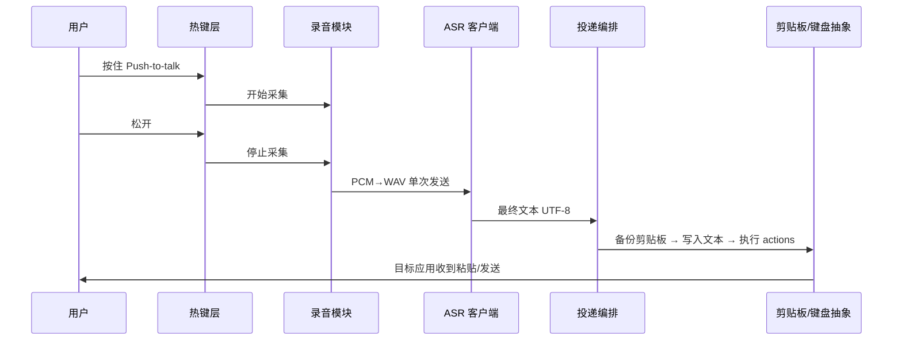

# AI 编程助手语音控制 - 技术方案

本文档在 [`requirement.md`](requirement.md) 需求与体验目标基础上，描述**实现架构、模块划分、关键接口、跨平台策略与质量保障**，供开发与评审使用。

---

## 1. 文档范围与假设

| 项目 | 说明 |
|------|------|
| **产品范围** | 录音 → ASR → 文本投递至当前焦点应用（优先 Cursor 聊天）；低阻力默认路径见需求文档 |
| **实现语言** | Python 3.8+ |
| **首版平台** | Windows 10+（验证路径）；macOS / Linux 通过抽象层扩展，见第 8 节 |
| **ASR** | 默认对接局域网 **ASR 服务**（WS 或 WSS，见 [`asr-service-api.md`](asr-service-api.md)）；本文给出**客户端职责与扩展点** |

---

## 2. 总体架构

### 2.1 逻辑分层

```
┌─────────────────────────────────────────────────────────────┐
│  app / cli                                                   │
│  进程入口、参数、生命周期、信号处理                            │
└────────────────────────────┬────────────────────────────────┘
                             ▼
┌─────────────────────────────────────────────────────────────┐
│  interaction（交互）                                          │
│  全局热键、托盘图标、轻量提示（可选）、谨慎模式 UI（可选）       │
└────────────────────────────┬────────────────────────────────┘
                             ▼
┌─────────────────────────────────────────────────────────────┐
│  pipeline（编排）                                             │
│  Push-to-talk 状态机：录音中 → 识别中 → 投递中 → 空闲           │
└───┬──────────────┬──────────────┬────────────────────────────┘
    ▼              ▼              ▼
┌────────┐   ┌──────────┐   ┌──────────────┐
│ audio  │   │ asr      │   │ delivery     │
│ 采集   │   │ 客户端    │   │ 剪贴板+按键   │
└────────┘   └──────────┘   └──────────────┘
    │              │                 │
    └──────────────┴─────────────────┴── config / history / logging
```

### 2.2 运行时数据流（主路径）



---

## 3. 模块划分（建议包结构）

与仓库目录对齐时可采用：

| 模块（建议路径） | 职责 |
|------------------|------|
| `vc.app_module.entry` | CLI、配置路径、`--validate-only`、程序入口编排 |
| `vc.config` | 加载 YAML、校验必填项、合并 profile、导出结构化 `AppConfig` |
| `vc.input_module.audio` | PyAudio 打开流、采样率与块大小、可选 WebRTC VAD、静音超时结束 |
| `vc.asr_module.client` | WebSocket 连接局域网 ASR、发送 **WAV 二进制**、解析 JSON 结果、超时 |
| `vc.output_module.delivery` | 按 `delivery.mode` 与 `actions` 执行；剪贴板备份/恢复；调用键盘抽象 |
| `vc.backends` | `ClipboardBackend`、`KeyboardBackend`、`HotkeyBackend` 协议与 Win 实现；预留 Darwin/Linux |
| `vc.core_module.pipeline` | 状态机、取消录音、与热键事件对接 |
| `vc.core_module.history` | 本地环形缓冲（最近 N 条）、供撤销/重发（持久化策略可后续定） |
| `vc.lexicon_module.service` | 本地术语词库（SQLite）与识别后纠正逻辑 |

**依赖方向**：`core_module.pipeline` → `input_module` / `asr_module` / `output_module` / `lexicon_module`；`output_module` → `backends`；禁止反向依赖业务层。

---

## 4. 核心接口（抽象）

### 4.1 配置模型

运行时由 `config.yaml` 解析为不可变数据类（或 TypedDict），至少包含：

- `asr`：`base_url`、`ws_path`、超时、可选鉴权占位  
- `hotkey`：字符串形式热键（与后端解析规则一致）  
- `delivery`：`mode`（`paste_and_send` | `paste_only` | `review`）、`profile`、`profiles[name].actions`  
- `history`：`max_items`

与 [`config.example.yaml`](../config.example.yaml) 同步演进；变更时同步更新本文档与示例配置。

### 4.2 剪贴板后端

```text
get_text() -> str | None
set_text(text: str) -> None
```

- 文本必须为 **Unicode**；中文为 UTF-8 在内存中的 `str`，由系统 API 处理剪贴板编码。  
- **投递前**：`old = get_text()`；写入识别结果并执行粘贴；**投递后**：根据产品策略 `set_text(old)` 恢复（可配置「是否恢复剪贴板」）。

### 4.3 键盘后端

```text
tap(keys: list[str])   # 如 ["ctrl","v"]；平台映射 cmd/ctrl
press(key: str)
release(key: str)
```

- 仅用于执行配置中的 `actions`，不做「逐字模拟中文输入」。  
- 键名采用 **小写语义名**（`ctrl`、`alt`、`shift`、`enter`、`f8` 等），由实现映射到库或系统 API。

### 4.4 热键后端

- **Push-to-talk**：按下开始录音，松开结束（需区分于「单击切换」模式，首版仅实现按住式）。  
- 实现可选用 `keyboard`（Windows）、`pynput` 或平台原生；需运行在**有足够权限**的上下文（管理员 / 辅助功能）。

### 4.5 ASR 客户端

- **输入**：采集得到 **PCM**，在客户端封装为 **标准 WAV** 后单次二进制发送（见 [`asr-service-api.md`](asr-service-api.md)）。  
- **输出**：单一 **最终字符串**（首版）；流式结果为后续优化。  
- **错误**：网络失败、协议错误、空结果 → 向上抛出可分类异常，由 `pipeline` 决定托盘提示文案。

实现层为 `WebSocketASRClient` / `MockASRClient`，便于 mock 与契约测试。

---

## 5. 管线与状态机

### 5.1 状态

| 状态 | 说明 |
|------|------|
| `idle` | 等待热键 |
| `recording` | 采集音频 |
| `recognizing` | 已停止采集，等待 ASR 返回 |
| `delivering` | 写剪贴板、模拟按键 |
| `error` | 可恢复错误，回到 `idle` 并提示 |

### 5.2 并发与线程模型（建议）

- **热键回调**可能在独立线程：仅向队列发送事件，**不在回调内做重活**。  
- **录音**：独立线程或异步读取流，避免阻塞 UI/主循环。  
- **ASR**：阻塞调用放在线程池或 `asyncio.to_thread`，避免卡死热键响应。  
- **投递**：短临界区；剪贴板 + 按键串行执行，避免与多实例竞争（单进程单实例建议）。

### 5.3 取消与重录

- **录音中**：Esc 或第二次热键策略 → 丢弃缓冲区，回到 `idle`。  
- **识别中**：若支持取消，需 ASR 侧支持中断连接或丢弃结果。  
- **重录**：清空本轮缓冲，回到 `recording`（若实现连续会话）。

---

## 6. 投递编排详解

### 6.1 模式

| 模式 | 行为 |
|------|------|
| `paste_and_send` | 备份剪贴板 → `set_text(transcript)` → 依次 `tap` actions（通常为 paste → send）→ 可选恢复剪贴板 |
| `paste_only` | 仅 paste 动作 |
| `review` | 识别结果展示后，用户确认再执行同上（实现可二期） |

### 6.2 动作序列

每个 `action` 含 `action` 类型与 `keys` 列表；执行顺序严格按 YAML 数组顺序。

- `pre_focus_chat`（可选）：用户配置的「聚焦 Chat」快捷键。  
- `paste`：`ctrl+v` / `cmd+v`。  
- `send`：`enter` 或可配置组合键。

### 6.3 中文与 IME

粘贴为 **已完成 Unicode 字符串**，不依赖 IME 组字；若目标应用焦点不在文本框，行为未定义，首版以**文档提示**为主，后续可加焦点检测（平台相关）。

---

## 7. 音频采集

| 参数 | 建议值 |
|------|--------|
| 采样率 | 16 kHz |
| 位深 | 16-bit |
| 声道 | mono |
| 缓冲 | 按 PyAudio 块读取，上限时长见需求（如 60 s） |

**VAD**：webrtcvad 用于可选「静音自动结束」；与「松开即停」可同时存在，策略在配置中择一或组合。

---

## 8. 跨平台策略

| 能力 | Windows（首版） | macOS | Linux |
|------|-----------------|-------|--------|
| 剪贴板 | `pyperclip` / `ctypes` | 同左或 `pyobjc` | X11/Wayland 差异，需实测 |
| 全局热键 | `keyboard` 等 | 需辅助功能权限；键名 `cmd` | Wayland 下全局监听可能受限 |
| 单实例 | 命名互斥体 / 文件锁 | 同左 | 同左 |

**原则**：业务逻辑只依赖 **协议接口**；平台差异封装在 `backends.*`。

---

## 9. 安全与隐私

- 录音数据默认**仅内存**，不落盘；若排障需落盘，必须显式开关并提示。  
- 与 ASR 服务通信使用 **WS 或 WSS**；`wss://` 时按部署处理证书（自签名仅建议可信内网）。  
- 历史记录仅存本地，路径与清除接口在 `history` 模块实现。  
- 日志中**禁止**默认打印完整用户语句；可脱敏或仅长度。

---

## 10. 可观测性与错误提示

- **结构化日志**：级别 + 模块 + 短消息；关键步骤 `recording_started`、`asr_ok`、`delivery_done`。  
- **用户可见错误**：ASR 不可达、剪贴板失败、热键注册失败，与需求 NFR-5 对齐。  
- **可选**：托盘气泡一行字显示末次识别摘要（隐私开关）。

---

## 11. 自动化测试（摘要）

与评审结论一致，分层实施：

| 层级 | 内容 |
|------|------|
| 单元 | `config` 解析、投递顺序、剪贴板备份逻辑（Fake 后端） |
| 契约 | Mock WebSocket ASR 返回固定 JSON/文本 |
| 集成 | Fake ASR + mock 键盘，断言调用序列 |

CI 默认不依赖真麦克风与真实 ASR 服务；`integration` marker 用于可选真实环境。详细用例与目录结构可在实现阶段补充 `docs/testing.md` 或 `pytest.ini`。

---

## 12. 打包与分发

| 方式 | 说明 |
|------|------|
| **源码** | `requirements.txt` + `python -m vc` |
| **Windows 可执行文件** | PyInstaller / cx_Freeze（后续）；注意 `keyboard`、PyAudio 二进制依赖打包 |
| **配置** | 与可执行文件同目录或 `%APPDATA%` 下固定路径（实现时定） |

---

## 13. 风险与未决项

| 项 | 说明 |
|----|------|
| ASR 服务协议变更 | 以服务端为准；客户端见 `asr-service-api.md` |
| Cursor 快捷键变更 | 仅能通过文档提示用户维护 `config.yaml` |
| Linux Wayland | 全局热键与剪贴板需单独验证 |

---

## 14. 文档与代码同步

- 需求变更 → 更新 `requirement.md`  
- 架构/接口变更 → 更新本文档与 `config.example.yaml`  
- 对外 ASR 部署与运维 → 以外部部署文档为准；API 约定以 [`asr-service-api.md`](asr-service-api.md) 为准

---

*文档版本：1.0.0*  
*创建时间：2026-03-26*  
*作者：coolbot*
